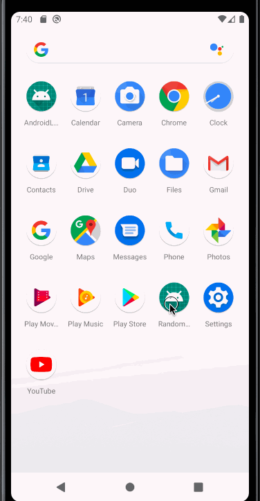

# Randomusers
Random Users application is to display Random Users list with user detail page.
It internally uses MVVM Architecture with Kotlin and Android Architectural components like,
  Data Binding, Coroutines, View Model, Live Data, Navigation Component, Dagger etc.. 

## API
Get random users list every time from below end point
https://randomuser.me/documentation#howto

## How it works
### Home Screen
Fetches initial data from random users API with 20 records at a time.
Once User scrolls down to bottom of list, it fetches new set of users and append to the list.
Each Api call fetches 20 records and display in UI and maintains page count.
On Click of list item it takes user to User Detail page with User object using Navigation component with Safe-Args.

### User Detail Screen
User detail page displays the detailed information about the user selected from Home screen.
On load of page it receives data using Nav Args provided by Safe-Args with Navigation component and binded to View Model.

# Random Users Screen

